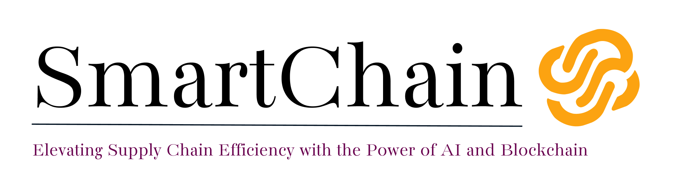

# TE-Mini-Project-24-25
### This is the main git repository for TE Miniproject
### Points to keep in mind : 
>* **Branch**: Create a new branch for each of the collaborator.For the branch naming use your name (preferred) or any other meaningful name.
>* **GitCheatSheet**: If you are confused with the git commands check out--> [Git Cheat Sheet](https://education.github.com/git-cheat-sheet-education.pdf)
>* **Sensitive Data**: Never commit sensitive information such as passwords, API keys, or personal data. Use environment variables or GitHub Secrets for sensitive information.
>ptive commit messages to provide context for changes.
>* **Large Files**: Avoid storing large files or binaries directly in the repository. Use [Git LFS(Large File Storage)](https://git-lfs.com/)  for managing large files.
>* **Communication** :Maintain clear communication with your team members through commit messages, comments on issues and pull requests, and project boards.
>* **Code Quality**: Ensure that your code is readable, maintainable, and follows best practices.

---
### Project Description : 
Develop a SaaS platform leveraging AI, ML, and blockchain to enhance supply chain transparency
and efficiency. Features include AI-driven inventory management, real-time tracking, supplier
verification, demand prediction, fraud detection, smart contracts, sustainability tracking, logistics
optimization, incident management, and a user-friendly dashboard.

---
### Project Objectives : 
* Enhance supply chain transparency and efficiency using AI, ML, and blockchain.
* Optimize inventory management and logistics through AI-driven solutions.
* Ensure data integrity and traceability with blockchain technology.
* Detect and prevent fraud using AI-based anomaly detection.

---
### Project Timeline :
|Sr.No.| Task Name | Assignees | Date Started | Date Ended |
|---|---|---|---|---|
|1| Proposal Submission & Discussion | All | 18/7/24|18/7/24|
|2| Topic Finalization | All | 18/7/24|25/7/24|
|3|Literature Survey/Existing System|All|25/7/24|1/8/24|
|4|Gap Identification & problem Statement|All|1/8/24|8/8/24|
|5|Proposed System | All| 8/8/24|29/8/24|
|6|Implementation 0 - 100 % |All|1/9/24|6/3/25|
|7|Paper Submission|All|27/4/25|27/4/25|
|8|Report Submission|All|28/4/25|28/4/25|


---
### Project Roles :
[**Savio Winson**](https://github.com/WINSAVIO) : *Project Management*

[**Swastik Sharma**](https://github.com/VoidAI2003): *Full Stack Development*

[**Reena Moncy**](https://github.com/reenamoncy) : *Front End Development*

[**Parth Gopakumar**](https://github.com/Rudrahunter):*Documentation Management*

---
### Steps for Installation

### For SmartChain Portal: 

In a new terminal window/tab: 

```bash
cd Admin Portal
npm install
cd ..
cd Client Portal
npm install
cd..
cd Backend 
npm install
cd ..
```

This will install all the necessary dependencies and libraries needed to run this file. 

>**Note**: To run the portals and the server you need to setup firebase and metamask accounts for your version of the application, also you need to have a model deployment endpoint service account key to access the models hosted on Vertex AI ( [Google Cloud Platform](https://cloud.google.com/?hl=en)).

## Setting up Blockchain and running the portals

### 1. Start the Local Blockchain (Hardhat)
Open a terminal and run:

```bash
cd Backend
npx hardhat node
```

This will start a local blockchain on `http://127.0.0.1:8545`.

---

## 2. Deploy the Smart Contract
In a new terminal window/tab:

```bash
cd Backend
npx hardhat run scripts/deploy.js --network localhost
```

---

## 3. Add Test Data to the Blockchain
In the same terminal:

```bash
npx hardhat run scripts/addTestData.js --network localhost
```

To verify blockchain data:
```bash
npx hardhat run scripts/verifyData.js --network localhost
```

---

## 4. Start the Backend Server
In a new terminal window/tab:

```bash
cd Backend
npm run dev
```

The backend will run on `http://localhost:4000`.

---

## 5. Start the Frontend (Admin Portal)
In a new terminal window/tab:

```bash
cd "Admin Portal"
npm run dev
```

The frontend will run on `http://localhost:3000` (or the next available port).

---

## 6. Access the Application
- Open your browser and go to `http://localhost:3000` to use the Admin Portal.
- You can interact with the blockchain, add/view transactions, and more.

---

## 7. (Optional) View Blockchain Data
To print all blockchain transactions in the terminal:

```bash
cd Backend
npx hardhat run scripts/verifyData.js --network localhost
```

---

## Troubleshooting
- If you see `EADDRINUSE`, the blockchain node is already running.
- If you get a 401 error, log out and log in again in the frontend.
- Make sure all terminals are in the correct directories before running commands.

---


>**Note**: This portal is still under heavy development
